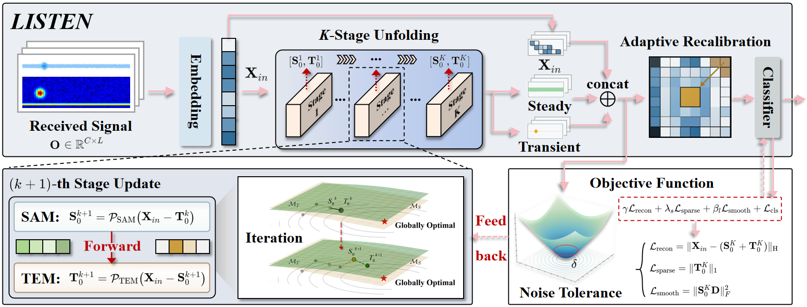
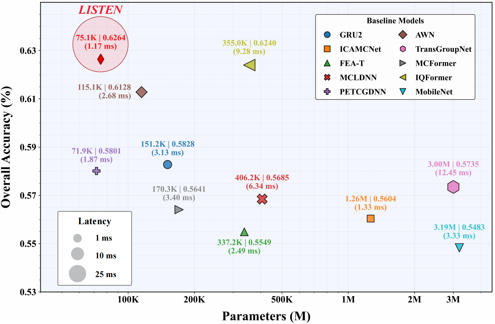

# LISTEN
---
## This is official code of paper "LISTEN: Learn to Isolate Sources, Then Enable Nimble Wireless Signal Recognition". 

The motivation of our work: We draw inspiration from the cocktail party effect (top). In this cognitive process, the human brain first decouples mixed acoustic waves into distinct streams and then selectively recognizes the target information. Motivated by this mechanism, we design LISTEN (bottom) to mimic this biological paradigm for wireless signal recognition.


Illustration of the proposed LISTEN.



Performance of LISTEN.



If you want to use SPCPNet, you can follow:
```python
    dummy_input = torch.randn(batch_size, 2, seq_length)
    model = SPCPNet(in_channels=2, num_stages=3, num_classes=num_classes, feature_dim=32)
    logits, S_k, L_k, X_feat = model(dummy_input)
    ...
